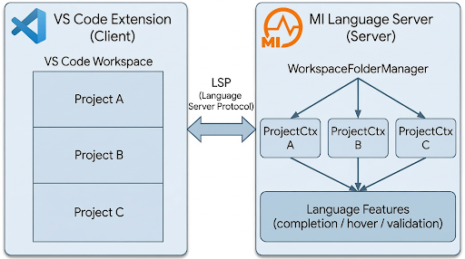

# Implementing Multi-Project Workspace Support for Current Language Server

The current WSO2 Micro Integrator (MI) Language Server typically serves each MI project with a separate language server instance when multiple projects exist in a workspace. This limits scalability, increases resource overhead, and breaks true multi-folder workspace experiences.

## Overview



### 1. Core XML Validation & Schema Isolation **(Completed)**

### 2. Eliminating Global State, Singletons & Context-Aware

### 3. Language Client (VS Code Extension) Integration


---

## Stage 1 Completed: LemMinX File Associations for Workspace Schema Validation

### Technical Overview
Introduced `File Associations` to replace the legacy namespace-based `catalog` implementation. Instead of relying on 
rigid catalogs, this approach maps specific file path patterns (e.g., glob matches for a project folder) to a specific target schema path. This enables different schemas (e.g., MI 4.3.0 and 4.4.0) to be applied to different projects simultaneously without conflict in a single LemMinX instance.

### Changelog & Implementation Details

#### 1. `Utils.java` (`org.eclipse.lemminx/customservice/synapse/utils/Utils.java`)
*   **Implementation of `updateSynapseFileAssociationSettings` Method:** 
    *   Previously, the system relied on `updateSynapseCatalogSettings`. 
    *   Added this new functionality to support File Association within the language server.

#### 2. `XMLLanguageServer.java` (`org.eclipse.lemminx/XMLLanguageServer.java`)
*   **Initialization Mode Selection:** The language server now dynamically determines the validation method during the `initialize` step by reading the `useAssociationSettings` flag from `initializationOptions`:
    *   **If `true` (Default):** The server invokes `Utils.updateSynapseFileAssociationSettings`, utilizing the new core standard based on file associations.
    *   **If `false`:** The server routes to `Utils.updateSynapseCatalogSettings` to process legacy catalog-based configurations.
    *   **If `null`/Undefined:** The server defaults to the file association method (`true`).
*   **Temporary Bridge:** 
    *   Because `SynapseLanguageService` (Stage 2) is not yet fully isolated for multi-root awareness, a temporary bridge was established.
    *   It sets the default Path to the first project in the collection: `synapseLanguageService.setSynapseXSDPath(workspaceSchemas.values().iterator().next());`

#### 3. `XMLWorkspaceService.java` (`org.eclipse.lemminx/XMLWorkspaceService.java`)
*   **Enhanced `didChangeWorkspaceFolders` Logic:** 
    *   Updated to capture dynamic workspace events correctly. 
    *   If a user adds a new project to the workspace after server initialization, it accurately intercepts the action and generates/applies XSD schemas for the new folder.

#### 4. `CleanMultiRootValidationTest.java` (`.../extensions/contentmodel/CleanMultiRootValidationTest.java`)
Established three comprehensive multi-root tests demonstrating core functionality:
1.  **Multi-Root Isolation:** Verifies that a single Language Server successfully provides isolated validations to two independent projects governed by distinct XSD files.
2.  **Dynamic Connector Generation Test:** Ensures that dynamically generated connector schemas are instantly picked up by the validation engine logic, operating independently of server restarts.
3.  **Dynamic Workspace Handling:** Asserts that when an entirely new project is dynamically appended to the workspace context at runtime, the language server successfully triggers its standard MI validations for the newly tracked space.
---
## How to Test

#### Testing via VS Code Extension
To verify the multi-root support directly within the VS Code environment:
1. **Build the Project**: Run the following command from the root directory to generate the server JAR:
   ```bash
   mvn clean install -DskipTests
   ```
2. **Update Extension Binary**: Navigate to the `target/` directory, locate the newly built JAR, and copy it into the `ls/` folder of your VS Code extension installation (replacing the existing JAR).
3. **Configure Settings Toggle**: When testing via the extension, you can toggle between the old and new logic by passing `useAssociationSettings` within your Language Server's `initializationOptions`.
   *   **Default Behavior**: If the `useAssociationSettings` field is **not mentioned** (omitted), the server will automatically default to `true` and work with the new **File Association** logic.
   *   If explicitly set to `true`, the language server continues to use the multi-root `fileAssociation` logic.
   *   If explicitly set to `false`, the language server natively falls back to utilizing the legacy single-project `catalog` settings extraction logic.

#### Standalone Test Execution
For automated testing without the IDE:
1. **Navigate to Root**:
   ```bash
   cd mi-language-server
   ```
2. **Run Targeted Tests**: Execute the specialized multi-root validation suite using Maven:
   ```bash
   mvn -Dtest=CleanMultiRootValidationTest test
   ```

---

## Next Steps

### Eliminating Global State, Singletons & Context-Aware
Transition legacy singletons (e.g., `ConnectorHolder`, `SynapseLanguageService`, Mediator Handlers ....) to be
resolved per project context instead of a global state.

* Introduce `ProjectContext` and `WorkspaceManager` classes to manage memory scoped to individual projects.
    *   *Reference Files:* `multi-workspace-support/resources/ProjectContext.java`, `multi-workspace-support/resources/WorkspaceManager.java`

* Isolate Language Server features (Auto-Complete, Go-To-Definition) per workspace.


### Language Client (VS Code Extension) Integration
Update the frontend VS Code Extension to natively support the multi-project backend API configurations and event hooks.
